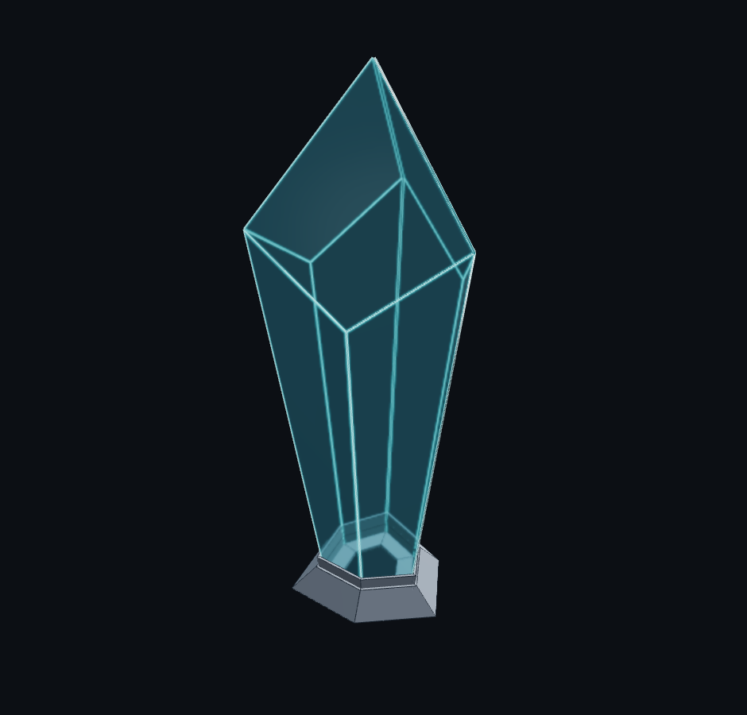

# Cadabra

**CAD + abracadabra.** A Claude Code plugin that conjures a **bespoke, live,
parametric CAD app per project**. You describe a physical thing you want to make;
the agent interviews you, captures the design into a living `PROJECT.md`,
scaffolds a self-contained 3D viewer, writes the geometry as code, and iterates
with you. The result is a folder you can open by **double-clicking an HTML file** —
no server, no build step — with sliders to tweak dimensions and buttons to export
fabrication files.

It generalises the ad-hoc "Claude + a hand-built interactive HTML modeller"
workflow into a repeatable skill, and extends the
[interview → build → self-review → iterate](https://pub.towardsai.net/i-taught-claude-to-design-3d-printable-parts-heres-how-675f644af78a)
loop with a **live user-controlled viewer**, a **two-tier geometry engine**
(instant analytic math + an in-browser CAD kernel), and **fabrication-aware
outputs** (3D print, laser/CNC cut, milling, carpentry).



---

## What it generates

A scaffolded project is a small, self-contained directory:

```
<project>/
  index.html     # the app shell — double-click to open (file://, no server)
  runtime.js     # the canonical engine (project-owned, editable): viewer, UI,
                 #   build pipeline, estimates, exports, config I/O, agent hook
  theme.css      # design tokens (dark CAD palette)
  kernel.js      # kernel tier (replicad/OpenCASCADE WASM in a Blob-URL Web Worker;
                 #   first-class, lazy — loads only when a kernel part is present)
  model.js       # ← AGENT-AUTHORED: the parametric design (params + geometry)
  PROJECT.md     # the LIVING design document (durable across sessions)
  config/        # named design presets (JSON)
  exports/       # generated STL / DXF / SVG / STEP + reference renders
```

You (and the agent) edit **`model.js`** in the common case — it declares each
part's parameters and builds its geometry. The viewer, controls, estimates, and
exports come from the schema automatically.

**No server by default.** The runtime loads three.js from a CDN via one inline ES
module, then runs `model.js`/`runtime.js` as classic scripts attaching globals —
which is what lets it work straight from `file://`. Even the heavy kernel tier
(replicad / OpenCASCADE WASM) loads from the CDN and runs in a Blob-URL Web Worker,
so a server is genuinely not required. (If a locked-down browser ever blocks
`file://`, `npx serve .` is a fallback — nothing depends on it.)

---

## Install

```shell
# Add this repo as a marketplace, then install the plugin:
/plugin marketplace add <path-or-git-url-to-this-repo>
/plugin install cadabra@cadabra
```

The marketplace (`.claude-plugin/marketplace.json`) points at `./plugin`, whose
manifest is `plugin/.claude-plugin/plugin.json`.

## Invoke

Just describe what you want to make:

> "Design a parametric phone stand I can 3D print."
> "Help me laser-cut an acrylic enclosure for this PCB."
> "I want to model a faceted crystal sculpture on a printed base."

The **`cadabra`** skill triggers and runs the workflow:

1. **Gather** — interviews you for use case, reference material, fabrication
   process, materials, dimensions, constraints, and aesthetic.
2. **Research** — looks up real-world dimensions (phone bodies, mounts, lumber,
   material densities) and records them with sources.
3. **PROJECT.md** — writes/updates the living design document, the source of
   truth that survives across sessions.
4. **Scaffold + author** — stamps out the project and writes `model.js`.
5. **Self-review + iterate** — you drag sliders for dimensional tweaks; the agent
   edits code for structural changes; occasional screenshots resolve visual
   questions.

---

## How the pieces fit

```
plugin/
  .claude-plugin/plugin.json      # plugin manifest
  skills/cadabra/
    SKILL.md                      # the workflow: gather → PROJECT.md → model.js → iterate
    reference.md                  # the model.js contract + analytic/kernel recipes
  templates/runtime/              # the canonical runtime, copied into each project
    index.html  runtime.js  theme.css  kernel.js  model.js (generic stub)
  examples/crystal/               # worked ANALYTIC project (crystal + printed base)
  examples/phone_case/            # worked KERNEL project (fillet + shell + boolean, STEP/STL)
  scripts/
    scaffold_project.mjs          # stamp out a new project (no agent tokens on boilerplate)
    screenshot.mjs                # on-demand PNG via Playwright over file:// (occasional)
    verify.mjs                    # verification gates over file://
  mcp/driver.mjs                  # OPTIONAL warm Playwright driver (only if you build an MCP server)
.claude-plugin/marketplace.json   # marketplace catalog → ./plugin
```

- **The template `model.js` is a generic stub** (a tiny example box). The plugin
  ships **no project-specific configuration**. The crystal+base model lives in
  `examples/crystal/` purely as a reference and to verify the runtime.
- **The runtime is project-owned**: each scaffold gets its own copy, so a project
  can diverge as far as it needs. The one invariant preserved through any rework
  is the `window.__app` agent hook.

---

## Two geometry tiers (both first-class)

| Tier | Engine | Use for | Output |
|---|---|---|---|
| **analytic** | plain JS vertex math | flat-panel / sheet-cut parts (laser/CNC), simple prisms — instant, offline, exact planar faces | clean per-panel DXF/SVG nesting |
| **kernel** | replicad (OpenCASCADE WASM) | fillets, chamfers, shells, booleans, lofts/sweeps, STEP, watertight guarantees | meshed B-rep + STEP/STL |

**Rule:** flat-panel sheet-cut part → `analytic`; anything needing curved B-rep
features / STEP / watertight → `kernel`.

The kernel tier is **fully supported and runs from `file://` with no server**: it
loads replicad's ESM + OpenCASCADE WASM from the CDN and runs the solve in a
**Blob-URL Web Worker** (a classic worker that uses dynamic `import()` — a module
worker can't instantiate from a Blob over `file://`, which is the one gotcha this
plumbing handles for you). It **lazy-loads only when a kernel part is present**, so
analytic-only projects pay nothing. Verified end-to-end by `examples/phone_case/`
(`node scripts/verify.mjs examples/phone_case/index.html`).

---

## Develop / verify (for plugin maintainers)

```shell
cd plugin
npm install                       # playwright
npx playwright install chromium   # once

# verify the generic stub template renders over file:// (no server):
node scripts/verify.mjs

# verify the analytic crystal example:
node scripts/verify.mjs examples/crystal/index.html

# verify the kernel phone-case example (boots replicad WASM in a worker over file://):
node scripts/verify.mjs examples/phone_case/index.html

# scaffold + capture a screenshot:
node scripts/scaffold_project.mjs --dir /tmp/demo --name "Demo" --fab printed
node scripts/screenshot.mjs --html examples/crystal/index.html --out shot.png --view iso
```

Every generated `index.html` must render without console errors, keep the
`window.__app` hook, and round-trip a config save/load — `verify.mjs` checks all
three over `file://`.

## License

MIT.
